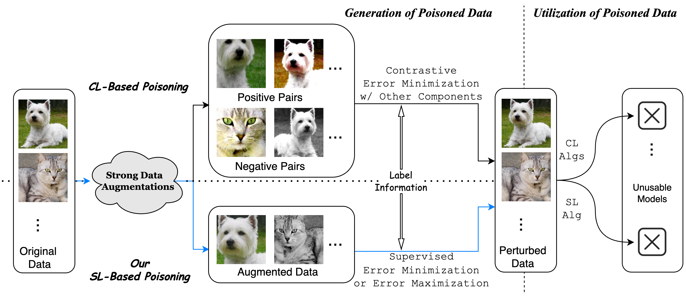

# Augmented Unlearnable Examples (AUE) <br> Augmented Adversarial Poisoning (AAP)
Code for NeurIPS 2024 paper ["Efficient Availability Attacks against Supervised and Contrastive Learning Simultaneously"](https://openreview.net/forum?id=FbUSCraXEB "openreview").




## Environment
The repository is tested on the following environment:
```angular2html
python=3.11.4
pytorch=2.0.1
torchvision=0.15.2
kornia=0.7.0
numpy=1.25.2
```

## Example Scrtipts
In `example.sh`, we provide generation and evaluation scripts for AUE and AAP attacks on CIFAR-10 and CIFAR-100.

### Generation
- For AUE attack, run the following command:
```angular2html
python aue.py --dataset <dataset> --backbone <model> --eps <eps> --strength <s> 
```
- For AAP attack, run the following command:
```angular2html
python aap.py --dataset <dataset> --backbone <model> --eps <eps>  --ref-strength <s1> --gen-strength <s2> \   
    [--untargeted] 
```
Activate the ```--untargeted``` flag for untargeted AAP.

### Evaluation
When evaluating the attack performance of a pretrained poison, specify the flag ```--poison-path <.../poison.pt>```. 
When training baseline models, delete the flag ```--poison-path```.
- Supervised learning
```angular2html
python evaluation_sl.py --dataset <dataset> --backbone <model> --experiment <poison_name> \
    --poison-path  <.../poison.pt> 
```
- Contrastive learning
```angular2html
python evaluation_cl.py --dataset <dataset> --backbone <model> --experiment <poison_name> \
    --method [SimCLR/MoCo/BYOL/SimSiam] \
    --poison-path  <.../poison.pt> 
```


## Citation
```
@inproceedings{WZG24,
    title={Efficient Availability Attacks against Supervised and Contrastive Learning Simultaneously},
    author={Yihan Wang and Yifan Zhu and Xiao-Shan Gao},
    booktitle={The Thirty-eighth Annual Conference on Neural Information Processing Systems},
    year={2024},
    url={https://openreview.net/forum?id=FbUSCraXEB}
}
```
